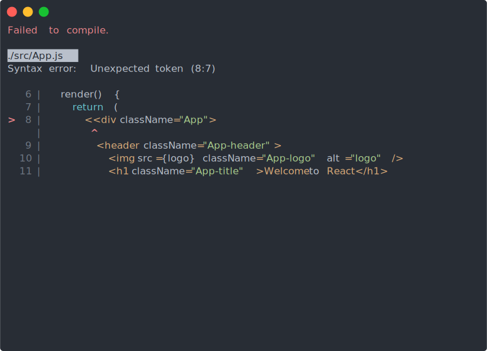

FastUI is a methodology for creating monorepo React applications. It offers a modern build setup with no configuration.

## Creating a Repository from GitHub Template

We can click on this link to generate a repository using the template:
[Create a new repository](https://github.com/QubitPi/fast-ui/generate) from QubitPi/fast-ui.
Alternatively, we can visit the [fast-ui repository on GitHub](https://github.com/QubitPi/fast-ui) and
click on the "Use this template" button on the top-right.

In both cases, the next steps are:

1. Enter a name for the new repository.
2. Uncheck "Include all branches".
3. Click on "Create repository from template".

For more details on how to create repositories using template, read the article on the GitHub website:
[Creating a repository from a template](https://docs.github.com/en/free-pro-team@latest/github/creating-cloning-and-archiving-repositories/creating-a-repository-from-a-template).

:::caution

If the repository is public, GitHub offers unlimited free build minutes. If it's a private repository, however,
[billing policy](https://docs.github.com/en/billing/managing-billing-for-your-products/managing-billing-for-github-actions/about-billing-for-github-actions#included-storage-and-minutes)
applies

:::

## After Creating the Repository

At this point, A ReactJS project with just what we need to start quickly has been generated. Developer can now
start adding business value and **get work done much faster in a standard way**. The following sections of this
documentation contain further details on how to proceed next.

```console
yarn
yarn start
```

Then open http://localhost:3000/ to see the app. When we are ready to deploy to production, create a minified bundle
with

```console
yarn build
```

That's it. We don't need to install or configure tools like webpack or Babel. They are preconfigured and hidden so that
we can focus on the code.

## Scripts

Inside the newly created project, we can run some built-in commands:

### `yarn start`

Runs the app in development mode. Open http://localhost:3000 to view it in the browser. The page automatically reloads
if we make changes to the code. we will see the build errors and lint warnings in the console.



### `yarn test`

Runs the unit tests

### `yarn cypress:open` and `yarn e2e`

Opens Cypress End-to-End test console and runs the End-to-End tests, respectively

### `yarn build`

Builds the app for production to the build folder. It correctly bundles React in production mode and optimizes the build
for the best performance. The build is minified and the filenames include the hashes.

Our app is ready to be deployed.

## Developing App

### Automatically Formatting Codebase

```console
yarn prettier --ignore-path .gitignore . --write
```

### Importing SVG

```typescript
import MySvg from "./example.svg"

function MyComponent(): JSX.Element {
  return (
    <div className="svgIcon">
      
    </div>
);
}
```
